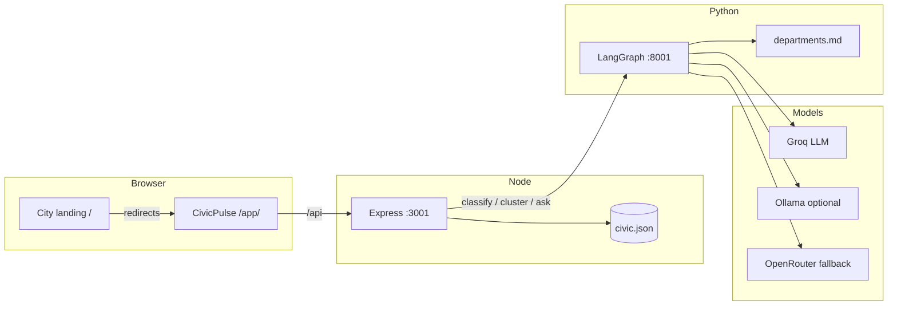
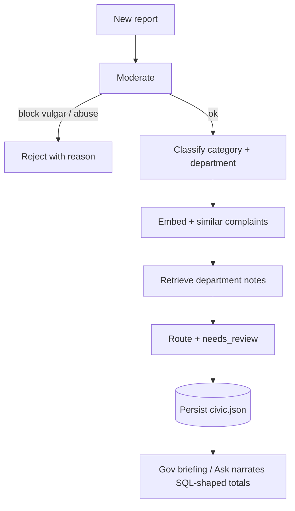
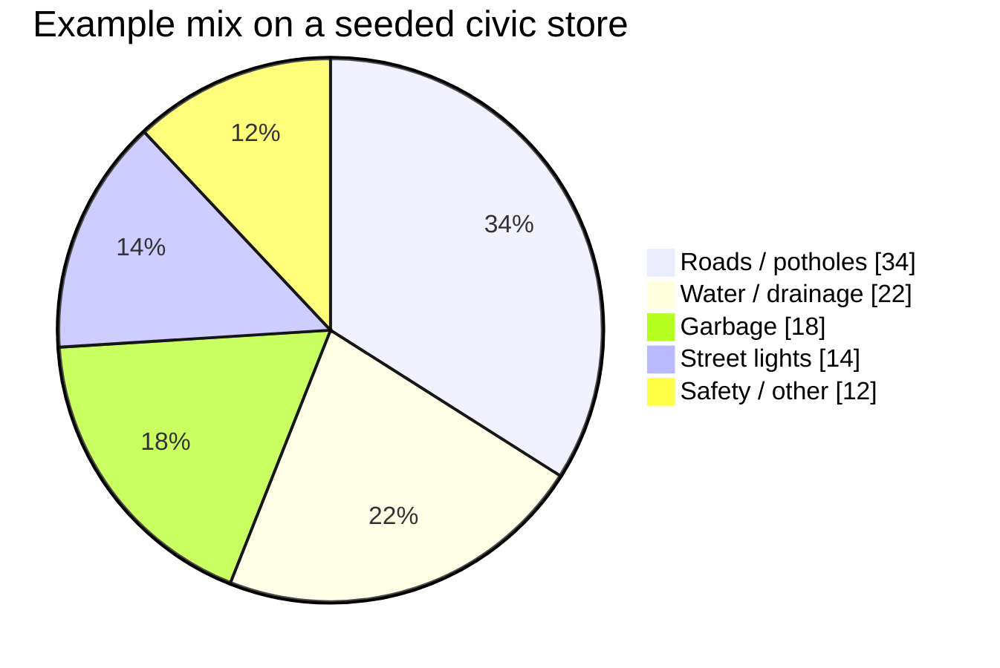

# Red-Box

<p align="center">
  
</p>

<p align="center">
  <strong>Anonymous civic reports in, grounded government intelligence out.</strong><br />
  Citizens file potholes, water, garbage, and safety issues without exposing identity on the public feed.<br />
  Officers see clusters, ward trends, and briefings that are required to match stored counts — not invented metrics.
</p>

<p align="center">
  
  
  
  
  
  
  
</p>

<p align="center">
  <code>anonymous-reporting</code> · <code>civic-tech</code> · <code>langgraph</code> · <code>groq</code> · <code>rag</code> · <code>ward-analytics</code>
</p>

---

## What it does

| Citizen | Government |
| --- | --- |
| File a report with location | KPI tiles from stored complaint counts |
| Public cards always say **Anonymous citizen** | Duplicate clusters (same street, paraphrased filings) |
| Pre-submit safety check | Ward chart, briefing, Ask, CSV / JSON / PDF |
| Status updates on the feed | Override category / department when review is needed |

Identity (`author_id`) is stored for the account that filed. It is **never** returned on public complaint DTOs.

---

## Architecture



If the Python worker is down, Express still classifies and clusters with local heuristics so the demo never hard-fails.



**LLM chain:** Groq → Ollama → OpenRouter → heuristic  
**Embeddings:** Ollama (`nomic-embed-text`) → OpenRouter → local 384-d hash (same as Express)



> The pie is illustrative of the product mix. Live KPI numbers in the government panel come from `server/data/civic.json`, not this diagram.

---

## Quick start

```bash
./start-all.sh
```

| Surface | URL |
| --- | --- |
| City landing | http://localhost:5173/ |
| App | http://localhost:5173/app/ |
| API health | http://localhost:3001/api/health |
| AI worker | http://127.0.0.1:8001 |

Copy `server/.env.example` → `server/.env`. Optional keys:

| Variable | Role |
| --- | --- |
| `GROQ_API_KEY` | Primary LLM ([console.groq.com](https://console.groq.com) — Groq, not xAI Grok) |
| `OPENROUTER_API_KEY` | Cloud fallback |
| `JWT_SECRET` | Change before any public deploy |
| `AI_SERVICE_URL` | Default `http://127.0.0.1:8001` |

```bash
# split processes
cd server && cp .env.example .env && npm install && npm run dev
cd ai && python -m venv .venv && source .venv/bin/activate && pip install -r requirements.txt && python server.py
cd client && npm install && npm run dev
```

Optional Postgres (schema only; the running API uses the JSON civic store):

```bash
docker compose up -d postgres
```

---

## Demo accounts

| Username | Password | Role |
| --- | --- | --- |
| `citizen_demo` | `password123` | File and track reports |
| `gov_demo` | `password123` | Intelligence panel |

Suggested path:

1. Log in as `citizen_demo`, file a pothole with a location.
2. File two paraphrases of the same stretch — they should share a cluster.
3. Log in as `gov_demo` → Intelligence: wards, clusters, briefing, Ask.
4. Export CSV/JSON from live store counts. Open a `needs_review` item if present.

Landing shortcuts: `register-complaint.html` → compose, `view-complaint.html` → search, `open-thoughts.html` → feed. The 3D city landing lives next to this repo at `../card/apple-3d-card` and is served at `/` without copying those assets into `client/`.

---

## Repository layout

```
Website/
├── client/          React + Vite (base /app/, landing plugin)
├── server/          Express API + civic JSON store
├── ai/              LangGraph worker, Groq, RAG over kb/
├── config/          Civic taxonomy
├── scripts/         API / AI verification
├── docker-compose.yml
└── start-all.sh
```

---

## HTTP surface (high level)

| Method | Path | Notes |
| --- | --- | --- |
| `GET` | `/api/health` | Process up |
| `POST` | `/api/auth/login` | JWT |
| `GET` | `/api/complaints` | Public list, anonymous authors |
| `POST` | `/api/complaints` | Create (auth) |
| `POST` | `/api/complaints/moderate` | Pre-submit check |
| `GET` | `/api/gov/overview` | Role: government |
| `GET` | `/api/gov/briefing` | Grounded narrative |
| `POST` | `/api/gov/ask` | Q&A over stored totals |
| `PATCH` | `/api/gov/complaints/:id` | Human override |

---

## Production checklist

- Set a long random `JWT_SECRET`. Do not ship the demo password as the only auth story.
- Put Express behind HTTPS; Vite `base` is `/app/` so reverse-proxy `/` (landing) and `/app/` (SPA) plus `/api` to `:3001`.
- `npm run build` at the repo root compiles server + client (`client/dist/app`).
- Keep `GROQ_API_KEY` (and any OpenRouter key) in the host secret store, never in git.
- Civic persistence today is `server/data/civic.json`. Point at Postgres using `server/sql/schema.sql` before real volume.

```nginx
# sketch — adjust root paths
location /api/ { proxy_pass http://127.0.0.1:3001; }
location /app/ { alias /var/www/civicpulse/client/dist/app/; try_files $uri $uri/ /app/index.html; }
location / { root /var/www/civicpulse/landing; }
```

---

## License

Private project unless you add a license file. Demo credentials are for local evaluation only.
